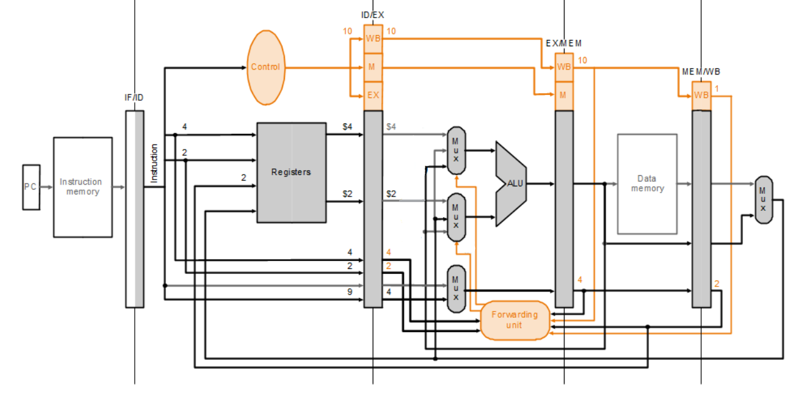
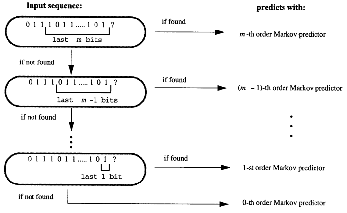
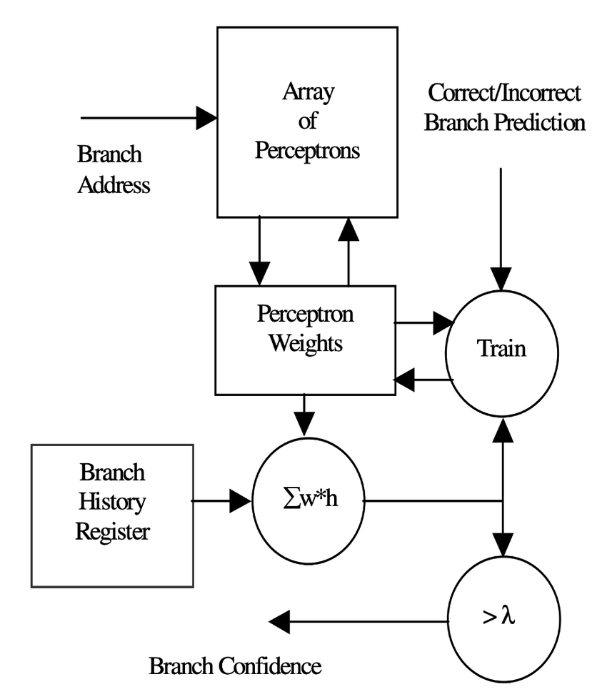
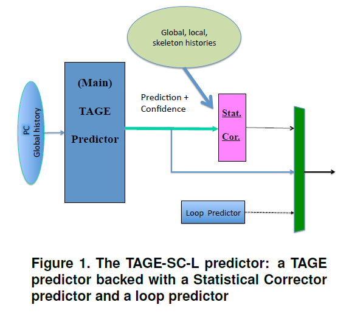
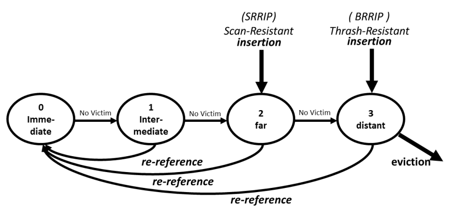
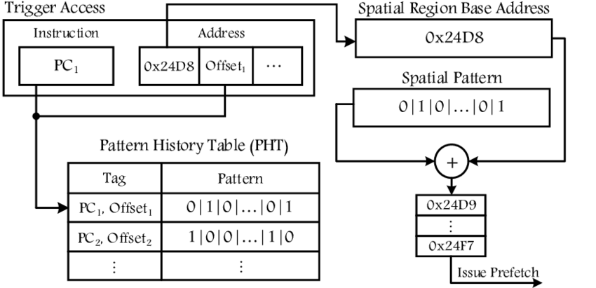
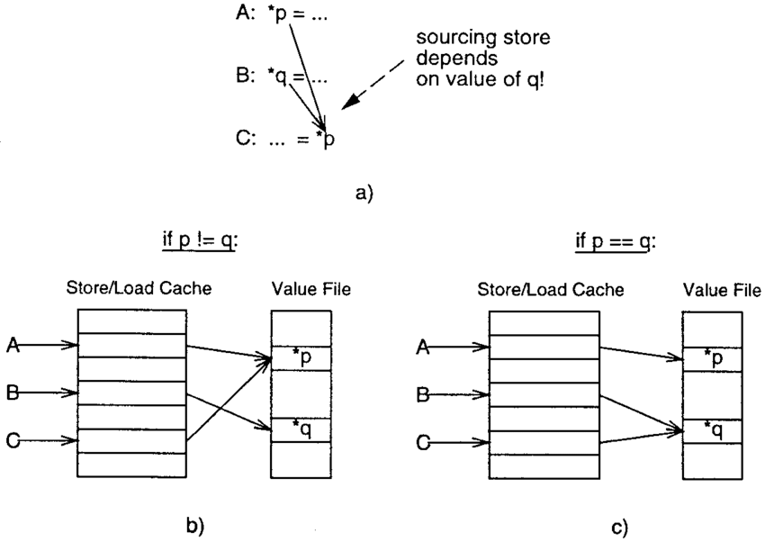

# Exam answers

### Introduction

1. Приведите формулы для Performance, Power / Dynamic Power, назовите параметры в них входящие

Golden rule of CS:

$ Performance = \frac{1}{Time} = \frac{1}{N_{instrs} * CPI * T_{cycle}} = \frac{1}{N_{instrs}} * IPC * f $

$ CPI $ - cycles per instruction\
$ IPC $ - instructions per cycle\
$ f $ - frequency\
$ T_{cycle} $ - clock signal period\
$ N_{instrs} $ - number of executed instructions

Power / Dynamic Power formula:

$ Power = P_{dyn} + leakage = C * V^2 * f + leakage $

$ P_{dyn} $ - Dynamic Power\
$ C $ - Dynamic capacity\
$ V $ - Voltage\
$ f $ - Frequency\
$ leakage $ - Power leakage on transistors and other elements

2. Объясните законы Мура (Moore’s law) и Деннарда (Dennard scaling)

> Moore's law:\
The number of transistors on integrated circuits doubles approximately every two years

> Dennard scaling:\
With each technology generation, as transistors get smaller, power consumption per unit area remains the same. Both voltage and current scale downward with transistor length.

3. Когда закончился Dennard scaling? Чем знаменуется его окончание?

Dennard scaling stopped working in ~2005-2006 because leakage losses don't scale with transistors size. In order to gain more performance industry focused on multicore CPUs and specialized computing units (GPUs, NPUs, etc).

4. В чем заключается идея Bypassing / Data forwarding оптимизации?

When implementing pipelined CPU, data hazards occur. CPU needs previous instructions results to execute next instructions. Example:

```asm
sub X2, x1, x3
and x12, X2, x5 // sub result used
```

But in classic pipeline implementation previous instructions results will only be avaliable after writeback stages of these instructions. So, in order to avoid stalls, data forwarding optimization can be used.

With this optimization instructions results are forwarded directly between stages:



5. Что такое Instruction-Level Parallelism? Приведите примеры оптимизаций для его повышения

Instruction level parallelism (ILP) is a parallel execution of multiple instructions at the same time (clock).

ILP optimizations/approaches:
- Superscalar CPUs: in-order or out of order
- VLIW
- Vector instructions

### Out-of-Order

1. Для чего нужен Reorder Buffer (ROB)?

Re-Order Buffer (ROB) is used in out of order CPUs to store instructions in program order. Independent instructions from ROB can be executed simultaniously. Then, executed instructions update architectual state in correct order while leaving ROB (retiring).

2. В чем сложность сделать ROB размером 10000 ячеек даже в случае доступной площади и power ресурса?

There are several factors that make big ROB sizes (e.g. 10000) unoptimal:

- Branches

When branch predictor fails, wrongly speculated instructions should be cleared

- Exceptions

Need to flush ROB when faulting instruction is retired.

- Traidoffs

Also, other CPU components also require area and power. So making larger ROB might not be as an effective, as making larger caches for an example.

3. Как бороться с False / Anti- Dependencies по регистрам? Что такое Register Aliases Table?

False dependencies:
- Write after write
- Write after read

When executing out of order, such dependencies should be handled for code to execute correctly. Common approach to handle false dependencies is a registers renaming.

Before instructions execution, registers renaming is performed. Architectual registers are replaced with physical registers (number of those registers in not limited by ISA).

Requirements:
- Producer and all its consumers are renamed to the same physical register.
- Producer writes to the original arch register at retirement.

Aliases are stored in Register Aliases Table (RAT).

RAT restore:
- Each ROB entry saves previous register alias (history)
- On flush, ROB restores history

4. Для чего нужна Instruction Queue (IQ) (по другому Scheduler Queue (SQ) / Reservation Station)? Когда инструкции удаляются из ROB, а когда из Scheduler Queue?

There are two complex searches through __all__ ROB entries:

- At allocation (once per instruction): to identify producers of the instruction sources
- At scheduling (every cycle): to idntify ready instructions and send those to execution

To avoid excessive work Scheduler Queue is introduced (20-30% of ROB size). Allocation and scheduling are performed on SQ. ROB is used for in-order retirement.

Instruction is deleted from SQ when it is ready for retirement, and from ROB when it is retiring.

5. Что такое Memory Disambiguation проблема? Как с ней бороться?

Memory Disambiguation problem: How execute loads and stores in OOO CPU efficiently while preserving visiblity of in-order execution.

Several basic technics are used to solve this problem:

- Stores are never performed speculatively or reordered among them

There is no transparent way to undo them. __Store commits its value to cache post retirement__

- Speculations on loads are restricted. All stores that might modify loaded memory should be executed (partially at least) first.

There are several advanced optimizations for speculative loads execution:

- Store forwarding
- Store buffer and load buffer
- Store address and store data microoperations

6. Объясните смысл разделения Store инструкции на Store Address / Store Data микрооперации

OOO CPU needs only stores addresses to detect intersections with loads that could be executed speculatively. If there are no instersections for some load -> execute it speculatively.

So, store instructions are divided into Store Address (STA) and Store Data (STD) microoperations. Thus, false dependencies from stores data can be elliminated.

7. Что такое Load speculation оптимизация?

Load speculation optimization:

Loads are executed speculatively without wait for older STAs. As soon as STAs are ready, speculations are verified.

### Branch Prediction

1. Какую информацию хранит Branch Target Buffer?

Branch Target Buffer (BTB) is used for predicting branch target of direct branches and even indirect branches.

It is organized as cache: a branch target PC is returned for given branch instruction PC.

Many modern processors used a hierarchy of BTBs:

- Small BTB (100 entries, 1 cycle latency)

- Middle BTB (2K entries, 3 cycle latency)

- ...

2. Опишите, как вы бы представили state-of-the-art предсказатель условных переходов на данный момент.

Types of modern branch predictors:

- PPM-based predictors



- Perceptron-based predictors



- Domain-specific predictors (e.g. loop termination predictors)

- Hybrid predictors

Current SOTA (year 2025) predictors are TAGE-based, while TAGE (TAgged GEometric history length) is a PPM-based predictor.

3. Task:

Процессор имеет двухуровневый адаптивный предскатель условных переходов (two-level adaptive conditional branch predictor). Предсказатель хранит направления последних бранчей (branch direction) из глобальной истории (global history) в регистре истории (BHR) размером 3 бита. Pattern History Table имеет размер 8 и использует стандартные 2 битные счетчики с насыщением (2-bit saturating counters). В начальных момент времени счетчики находятся в состоянии “Strongly Not Taken”. Рассчитайте missprediction rate (процент неверных предсканий) для данного предсказателя условных переходов в случае исполнения программы ниже.

```C++
for (int i = 0; i < 100; ++i)
    std::cout << i << "\n";
```

This code might compile to various assembly. If we assume that writes to std::cout will not affect conditioanl branches prediction (e.g. if there will be no conditional branches executed on these writes), we can assume following code variants:

Variant 1:

```Asm
.loop_begin:
    xor ebx, ebx
.loop_body:

    ...

    add ebx, 1
    cmp ebx, 100
    jne .loop_body
```

Variant 2:

```Asm
.loop_begin:
    xor ebx, ebx
.loop_body:
    cmp ebx, 100
    je .loop_end

    ...

    jmp .loop_body
.loop_end:
```

In case of Variant 1:

Predictions will be wrong until history buffer will be filled with all ones and corresponding entry in pattern history table will contain weakly NT. So depending on current history pattern it will take from 2 to 5 iterations for predictor to adapt. Then the last prediction will fail when CPU will exit cycle

And thus, the resulting missprediction rate can be in the range:

$[\frac{3}{101} \approx 2.97*10^{-2}*, \frac{6}{101} \approx 5.94*10^{-2}]$

In case of Variant 2:

prediction will be wrong only on loop exit, so the resulting missprediction rate will be:

$\frac{1}{101} \approx 0.99*10^{-2}$

4. Объясните связь двухуровневых адаптивных предсказателей (two-level adaptive branch predictor) и алгоритма PPM (Prediction by Partial Matching)

Both predictors use branch history register (BHR) of size N for prediction. But this history is used differently:

- Two level adaptive branch predictor uses two-bit saturating counters corresponding to each BHR value

- PPM uses cascade of Markov predictors of orders N, N-1 ... 0. Predictor of highest avaliable order is used:


5. Какими полезными свойствами обладает перцептрон (perceptron) с точки зрения обработки входных данных? Опишите, какую функцию выполняет перцептрон в случае использования в виде статистического корректора (statistical corrector)

Perceptron is good at combining inputs of different types.

PPM/TAGE predictors have cold counter problem: they take long time to train and perform poorly on H2P (hard to predict) branches. To fix these problems, __statical corrector__ predictor (perceptron-based) is used to correct statically biased branches prediction. This corrector can used wide spectrum of data to correct predictions (e.g. both global and local histories)



6. Какие виды условных переходов являются сложно-предсказываемыми для предсказателя TAGE?

Hard to predict (H2P) branches for TAGE:

- Data-dependent branches

- Weakly correlated branches

7. Объясните основный смысл рассмотренной на лекции статьи “Branch Prediction is Not a Solved Problem”

“Branch Prediction is Not a Solved Problem” is a paper that was published by Intel in 2019. And one of the main ideas described in this paper is that: "Addressing remaining mispredictions can lead up to 20% IPC speedup". This means that further branch predictors developement can give good preformance boost.

Also, two primary reasons for mispredictions are mentioned in this paper:

- Systematically hard to predict branches

- Rare branches with low dynamic execution counts over 10s of millions instructions

### Memory

1. В чем разница между Fully Associative, Direct Mapped и Set-Associative кэшами?

Fully Associative, Direct Mapped and Set-Associative caches differ in cache slots allocation policies:

- Any cache slot can be allocated by any line in Fully Associative cache

- Only one cache slot can be allocated by line with given address (slot with related set)

- Set-Associative cache is in between of two other approaches. Only a set of cache slots can be allocated by line with given address (slots with given set)

2. Для чего используется Translation Lookaside Buffer (TLB)?

Translation Lookaside Buffer (TLB) caches recently used page table (PT) entries

3. Что такое гранулярность политик замещения?

Cache replacement policies solve a prediction problem, the goal is to predict whether any given line should be allowed to sta in cache. The decision is re-evaluated during chache line lifetime, from insertion to eviction.

Granularity of cache replacement policies:

- __Coarse-grained__ policies:

Treat all lines identically when they are inserted into cache and only differenciate among lines based on their behaviour in the cache

- __Fine-grained__ policies:

Distinguish among lines when they are inserted into cache (in addition to observing their behaviour in cache)

4. Какие есть стандартные паттерны обращения к кэшу?

There are several common access patterns for caches:

- Recency-Friendly: $ (a_1, ... , a_k, a_k, a_{k-1}, ... , a_1)^N $

- Thrashing: $ (a_1, ... a_{k-1}, a_k)^N, k > C $

- Streaming: $ (a_1, ... a_{k-1}, a_k), k = \inf $

- Mixed (Scanning): $ [(a_1, ... , a_k)^A P_{\epsilon}(b_1, ... , b_m)]^N $

Where:

$ C $ - Cache set associativity\
$ a_i $ - Cache line access\
$ (a_1, ... a_{k-1}, a_k) $ - Temporal sequence of k unique accesses to a cache set\
$ (a_1, ... a_{k-1}, a_k)^N $ - Temporal sequence repeated for $ N $ times\
$ P_{\epsilon}(a_1, ... , a_m) $ - Temporal sequence that occurs with some probability $ P_{\epsilon} $

5. В каком ключе LRU Insertion Policy (LIP) лучше классической LRU политики замещения?

LRU Insertion Policy (LIP) is quite similar to classic LRU policy. The only difference is that the new element is inserted to the LRU position (not MRU position as for classic LRU policy). This makes LIP better in case of trashing access pattern.

6. За счет чего BRRIP политика замещения является устойчивой к scanning и thrashing паттернам?

Re-Reference Interval Prediction (RRIP) cache policies use following state machine, which predicts re-reference distance for lines:



BRRIP policy:

- Insertion: RRPV = 3 for most insertions, RRPV = 2 with probability $ \epsilon $

- Promotion: RRPV = 0

- Aging: Increment all RRPVs (if no line with RRPV = 3)

- Victim: RRPV = 3

This policy is resistant to thrashing:

New lines are firstly placed near to victim position, so if such lines will not be accessed in the nearest future, they will be evicted.

This policy is also resistant to scanning:

New lines can be placed to RRPV = 2, so such lines will be able to remain in cache until next access.

7. В чем основная идея политик замещения Hawkeye и Mockingjay?

Hawkeye and Mockingjay use semi-Belady algorithm: by learning previous accesses they learn to predict future accesses and use Belady's MIN algorithm on this predictions

8. Объясните принцип работы Spatial Memory Streaming (SMS) префетчера

Spatial prefetching algorithms divide the memory address space into fixed-sized sections, named Spatial Regions, and learn the memory access patterns over these sections. Learned patterns are then used for prefetching.

Spatial Memory Streaming is a spatial prefetching algorithm that stores information about previous access patterns in Pattern Histoy Table (PHT). This table translates trigger access tag (PC + spatial region offset) to expected access pattern in spatial region.



### Advanced Optimizations & Parallelism

1. На покрытие какие сложных случаев направлено использование Execution-based Prefetchers?

Execution-based prefetches can be usefull in following scenarios:

- Irregular access patterns: e.g. accesses to hash map

- Pointer chasing: lists, trees, graphs traversals

- Data-dependent accesses

2. Что такое Value Prediction оптимизация? Для каких инструкций, как правило, используется данная оптимизация в современных процессорах?

Value prediction predicts the values of instructions before they are executed. Such optimizations eliminate value dependencies.

This optimizations are commonly used for following instructions:

- Loads

- Expensive arithmetics

- Instructions with good gain (on success) and penalty (on mispredict) balance (also considering prediction confidence)

3. За счет чего получается прирост производительности в случае применения Value Prediction оптимизации?

Commonly, value locality is high in programms. Thus, Value Prediction can improve OOO pipeline utilization by data dependencies elimination.

4. В чем разница между Value Prediction и Branch Prediction с точки зрения необходимости / ожидаемого положительного эффекта от предсказания и последующего спекулятивного исполнения в случае низкой уверенности в точности предсказания?

- Branch Prediction: reward is high when compared to penalty

- Value Prediction: penalty is high when compared to reward

Thus, Value Prediction should only be applied when prediction confidence is high, or reward is higher than usual

5. Что такое Memory Renaming оптимизация?

Memory Renaming optimization finds loads and stores that access the same memory and redirects executed memory instructions data to instructions that load the same memory. Information about Executed memory instructions is kept in Store/Load Cache and data is kept in Value File.



6. Объясните разницу между Fine-Grained Multithreading, Coarse-Grained Multithreading и Simultaneous Multithreading

Types of Multithreading:

- Fine-Grained

Idea: Switch to another thread every cycle such that no two instructions from the same thread are in the pipeline concurrently.

Such approach tolerates data and control dependency latencies by overlapping the latency with useful work from other threads.

- Coarse-grained

Idea: When a thread is stalled due to some event (e.g. cache miss, sync event, FP operations), switch to a different HW context.

Profits are similar to Fine-Grained multithreading, but Coarse-Grained approach is easier to implement.

- Simultaneous

Idea: Instructions from multiple threads are executed concurrently in the same cycle.

Such approach allows to achive higher utilization than other types of multithreading.
