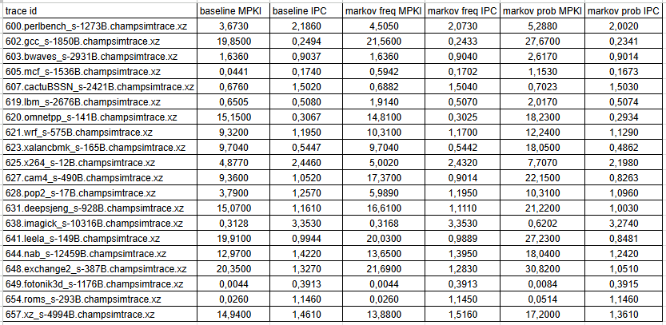
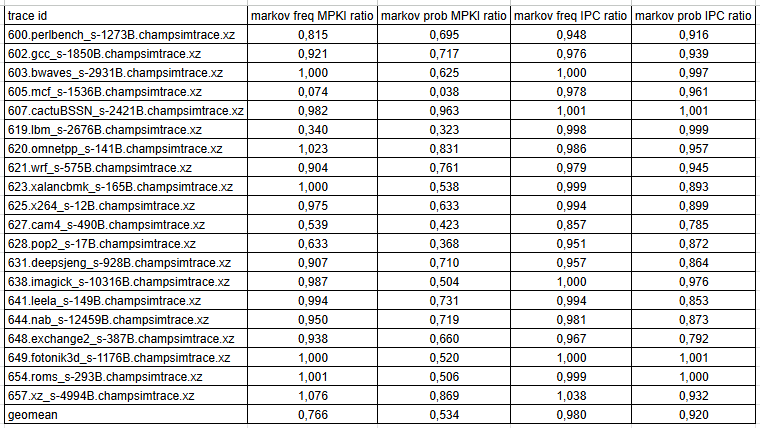

## Lab 01: Branch research

### Task

1) Implement Markov Predictor (frequency counters)
2) Implement Markov Predictor (probability approach)
3) Compare predictors 1 & 2 with bimodal predictor

Traces to compare results on:

- 600.perlbench_s-1273B.champsimtrace.xz
- 602.gcc_s-1850B.champsimtrace.xz
- 603.bwaves_s-2931B.champsimtrace.xz
- 605.mcf_s-1536B.champsimtrace.xz
- 607.cactuBSSN_s-2421B.champsimtrace.xz
- 619.lbm_s-2676B.champsimtrace.xz
- 620.omnetpp_s-141B.champsimtrace.xz
- 621.wrf_s-575B.champsimtrace.xz
- 623.xalancbmk_s-165B.champsimtrace.xz
- 625.x264_s-12B.champsimtrace.xz
- 627.cam4_s-490B.champsimtrace.xz
- 628.pop2_s-17B.champsimtrace.xz
- 631.deepsjeng_s-928B.champsimtrace.xz
- 638.imagick_s-10316B.champsimtrace.xz
- 641.leela_s-149B.champsimtrace.xz
- 644.nab_s-12459B.champsimtrace.xz
- 648.exchange2_s-387B.champsimtrace.xz
- 649.fotonik3d_s-1176B.champsimtrace.xz
- 654.roms_s-293B.champsimtrace.xz
- 657.xz_s-4994B.champsimtrace.xz

### Implementation

Implemented predictors can be found at `branch/markov_frequency` & `branch/markov_probability`

### Raw data

Here are raw measurments from ChampSim for considered traces:

### Ratios

Here are MPKI ratios (baseline MPKI / Markov MPKI - higher is better) & IPC ratios (Markov IPC / baseline IPC - higher is better):

### Analysis

As we can see, considered Markov predictors show worse performace when compared to bimodal predictor (baseline).

This can be caused by high inertia or Markov predictors: when program behaviour is changed such predictors will need more time to adapt to new execution scenario (as there are no limits for counters in Markov predictors).

Also, Markov predictor with probability approach shows worse results when compared to Markov predictor with frequency approach. This can be caused by worser ability to predict cycles branches and other branches with similar behaviour (e.g. conditionals in cycles).

Example: Cycle with fixed number of iterations = N
- Frequency approach misprediction expectation per full cycle execution: 1
- Probability approach misprediction expectation per full cycle execution:

$N * P_t + 1 * P_{nt} = N / (N + 1) + N / (N + 1) = 2N / (N + 1) \approx 2$ for $ N >> 1 $

Also, behaviour for instructions without data will be different:

- Frequency approach will always predict taken
- Probability approach will predict taken and not taken with probability of 0.5

This may affect results too
