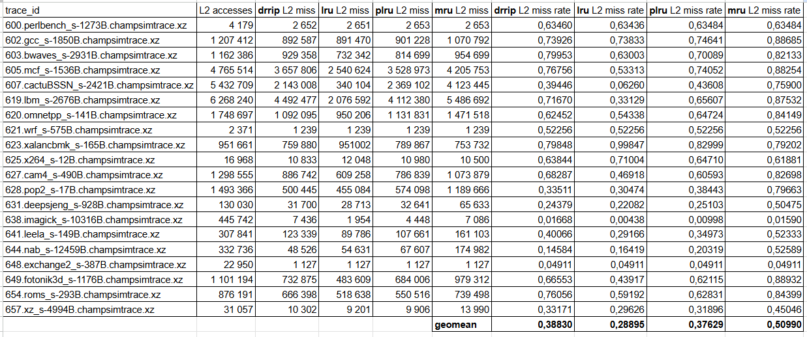
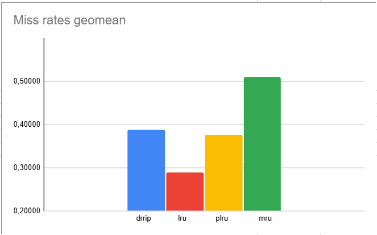

## Lab 02: Cache research

### Task

1) Implement PLRU
2) Implement MRU
3) Compare PLRU, MRU, DRRIP and LRU L2 miss rate

Traces to compare results on:

- 600.perlbench_s-1273B.champsimtrace.xz
- 602.gcc_s-1850B.champsimtrace.xz
- 603.bwaves_s-2931B.champsimtrace.xz
- 605.mcf_s-1536B.champsimtrace.xz
- 607.cactuBSSN_s-2421B.champsimtrace.xz
- 619.lbm_s-2676B.champsimtrace.xz
- 620.omnetpp_s-141B.champsimtrace.xz
- 621.wrf_s-575B.champsimtrace.xz
- 623.xalancbmk_s-165B.champsimtrace.xz
- 625.x264_s-12B.champsimtrace.xz
- 627.cam4_s-490B.champsimtrace.xz
- 628.pop2_s-17B.champsimtrace.xz
- 631.deepsjeng_s-928B.champsimtrace.xz
- 638.imagick_s-10316B.champsimtrace.xz
- 641.leela_s-149B.champsimtrace.xz
- 644.nab_s-12459B.champsimtrace.xz
- 648.exchange2_s-387B.champsimtrace.xz
- 649.fotonik3d_s-1176B.champsimtrace.xz
- 654.roms_s-293B.champsimtrace.xz
- 657.xz_s-4994B.champsimtrace.xz

### Implementation

Implemented replacement policies can be found at `replacement/plru` & `replacement/mru`

### Data

### Analysis

As expected:

- MRU gave the worst results among all other policies

- LRU outperformed PLRU (as PLRU is only an approximation of LRU)

Unexpectedly, DRRIP showed results worse than PLRU and LRU. DRRIP might not be so good for L2 with used cache configuration (default one).
